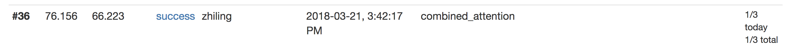
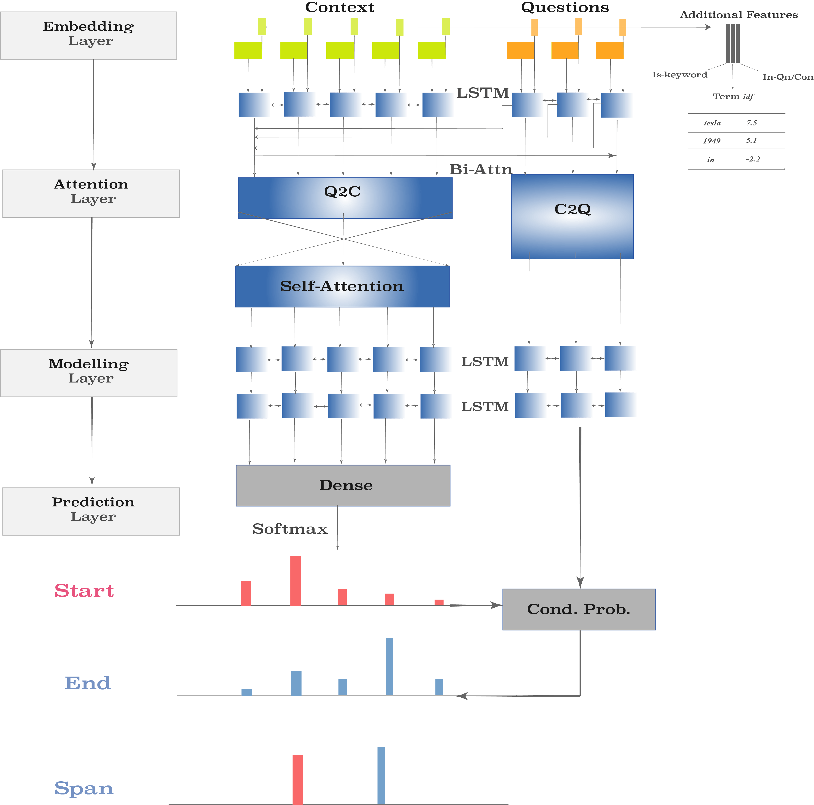
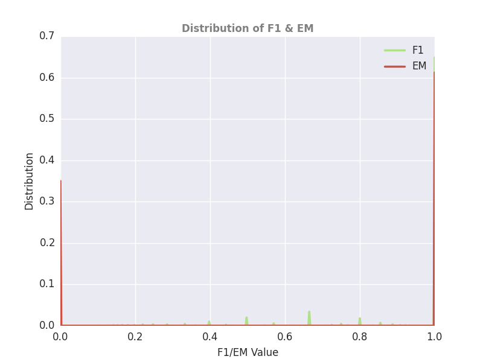
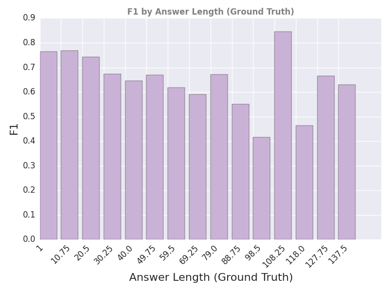
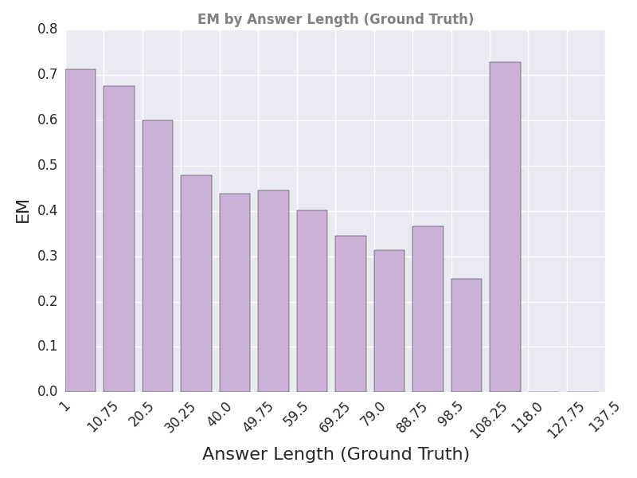
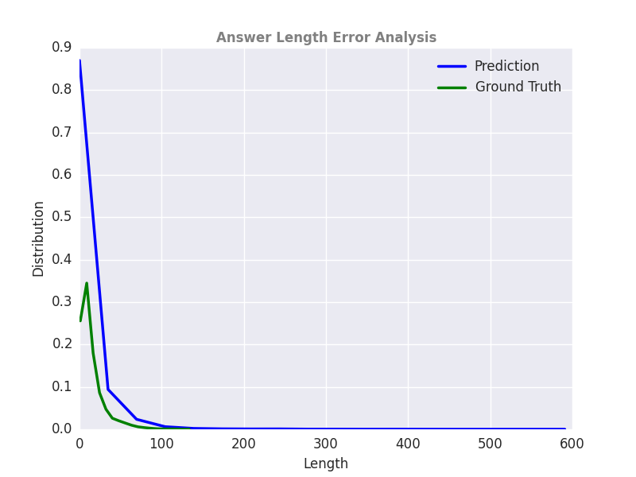
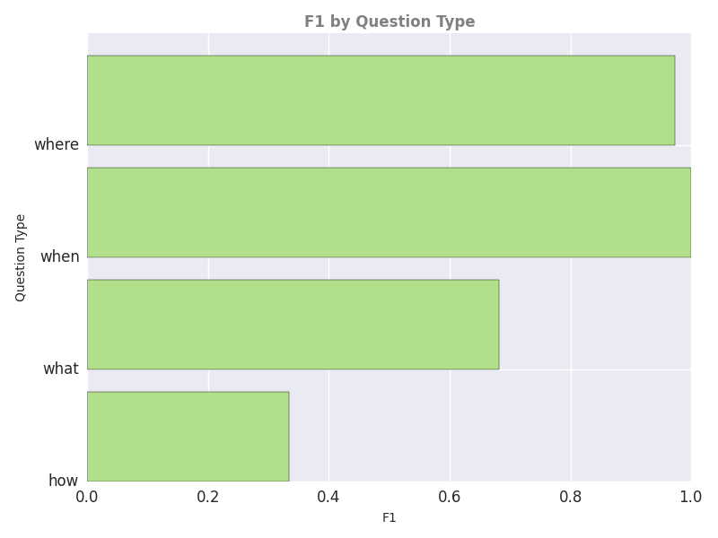
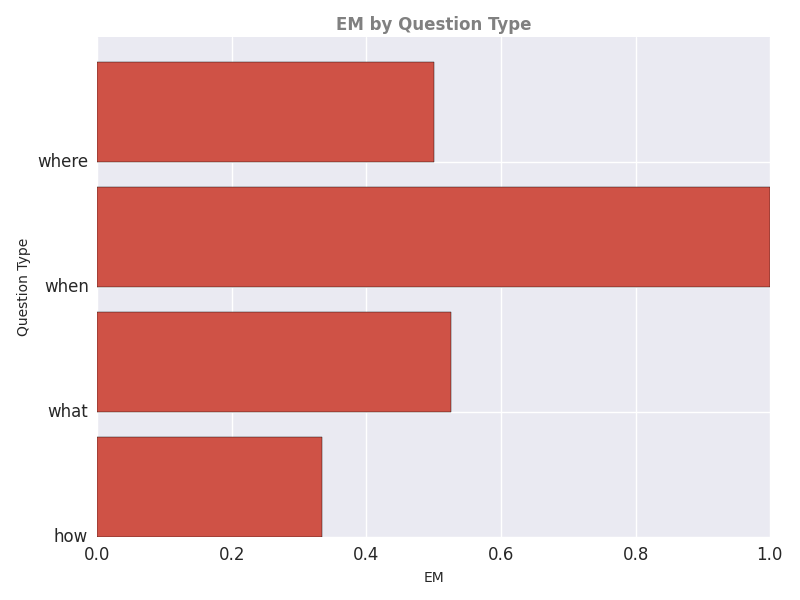
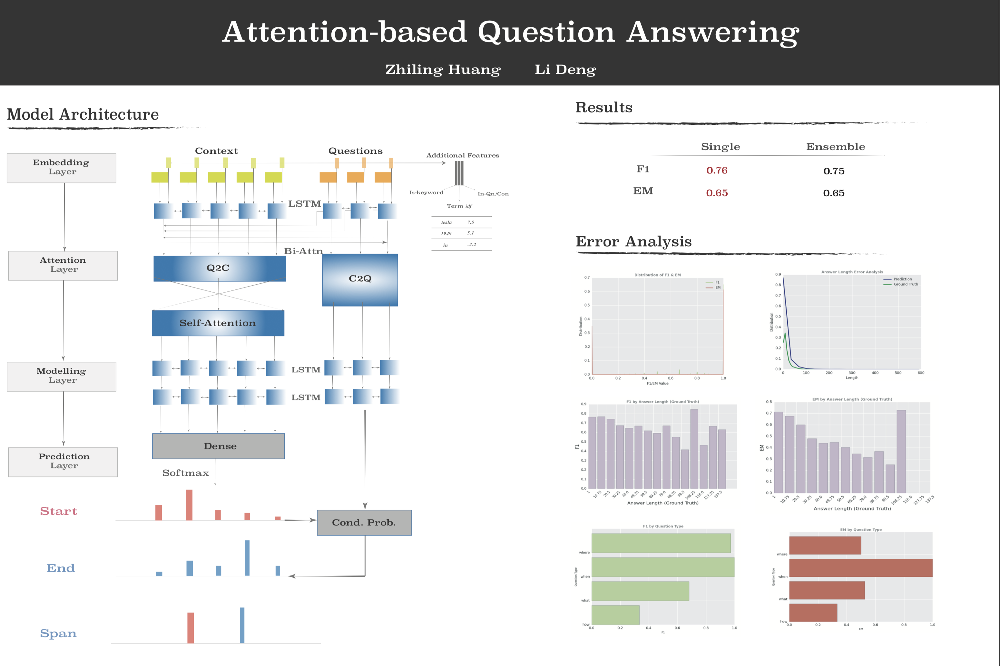
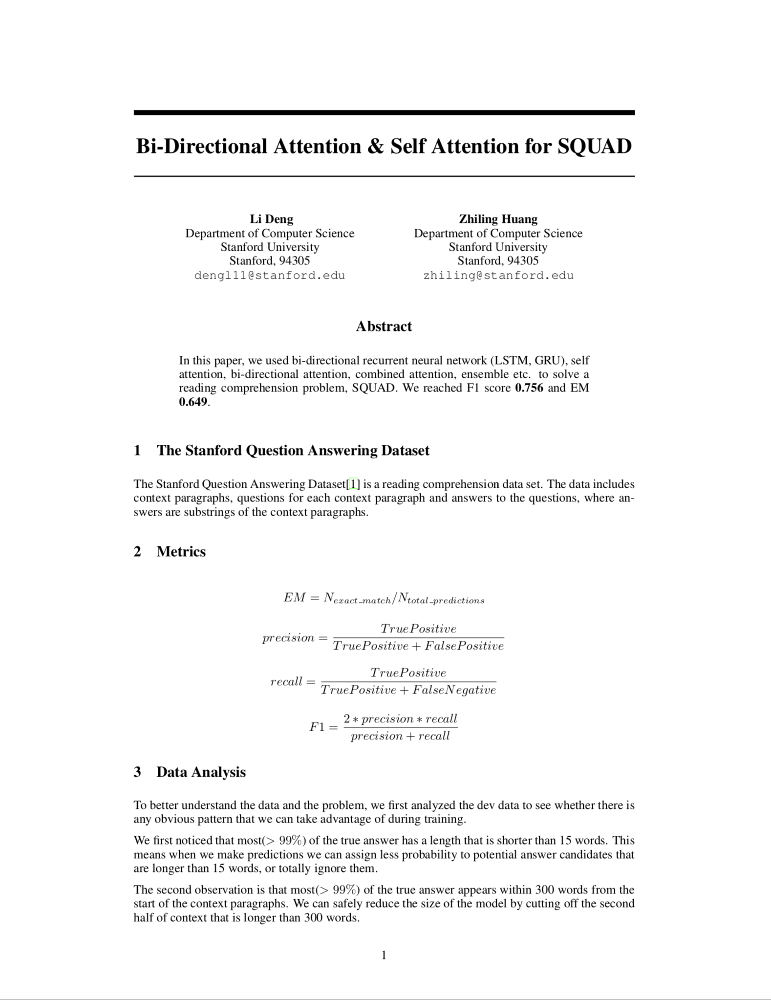

# CS224N-Project-Machine-Reading 
#### Stanford 2018 Winter

### Team 
----------------
- **Li Deng** (dengl11@stanford.edu)
- **Zhiling Huang** (zhiling@stanford.edu)

### Test Score: F1 76.2% , EM 66.2%

### Architecture
----------------

### Error Analysis
----------------

### Poster 
----------------

### Report  
----------------

